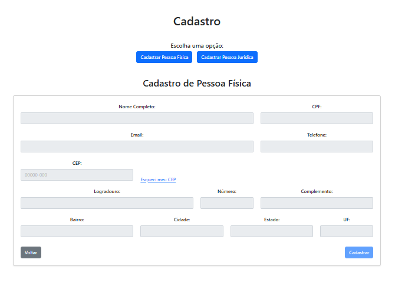

# CustomerRegistration

# Sistema de Cadastro de Clientes

Este projeto é um sistema de cadastro para pessoas físicas e jurídicas, desenvolvido utilizando Angular 13 com foco em boas práticas de desenvolvimento, responsividade e integração com banco de dados PostgreSQL.

## 📋 Descrição

O sistema permite o cadastro de clientes, sejam pessoas físicas ou jurídicas, com uma interface amigável e responsiva, utilizando **Bootstrap**. Todas as informações são validadas com rigor, usando **regex** e máscaras, garantindo a integridade dos dados. A aplicação segue os princípios de **orientação a objetos** e **clean code**, proporcionando um código modular e fácil de manter.

## 🚀 Tecnologias Utilizadas

- **Angular 13**: Framework principal para desenvolvimento do frontend.
- **Bootstrap**: Para design responsivo e estilização.
- **API REST**: Para comunicação entre o frontend e o backend.
- **PostgreSQL**: Banco de dados utilizado para armazenamento dos dados dos clientes.
- **Regex & Masks**: Validações e máscaras aplicadas nos formulários.

## 📦 Funcionalidades

- Cadastro de pessoas físicas e jurídicas.
- Validações de campos com **regex** e máscaras.
- Interface responsiva, adaptável a diferentes dispositivos.
- Integração com API REST para operações CRUD.
- Armazenamento de dados no banco de dados PostgreSQL.

## 🎨 Layout Responsivo

O projeto foi desenvolvido com foco em design responsivo, utilizando **Bootstrap** para garantir que a interface seja amigável em qualquer dispositivo, seja desktop, tablet ou smartphone.

## 🛠️ Pré-requisitos

📝 Licença
Este projeto está sob a licença MIT. Veja o arquivo LICENSE para mais detalhes.

📫 Contato
Para dúvidas ou sugestões, entre em contato:

Nome: Fagner Lisboa
- **LinkedIn:** [Fagner Lisboa](https://www.linkedin.com/in/fagner-lisboa-dev/)
- **GitHub:** [FagnerLisboa](https://github.com/FagnerLisboa/)

